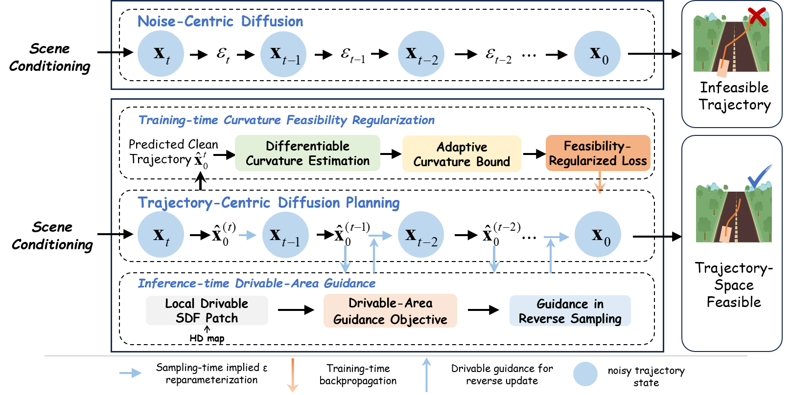

# FeaXDrive: Feasibility-aware Trajectory-Centric Diffusion Planning for End-to-End Autonomous Driving

<div align="center">

[](https://arxiv.org/abs/2604.12656)
[](https://arxiv.org/pdf/2604.12656)
[](https://doi.org/10.48550/arXiv.2604.12656)
[](LICENSE)

</div>

## Overview

End-to-end diffusion planning has strong potential for autonomous driving, but generated trajectories may still violate trajectory-level feasibility: they can be locally irregular, kinematically infeasible, or inconsistent with the drivable area. FeaXDrive addresses this problem by moving feasibility modeling into **clean trajectory space**.

<div align="center">
  
</div>

FeaXDrive treats the predicted clean trajectory as the unified object throughout training, sampling, and post-training:

1. **Trajectory-centric diffusion planning**: predict the clean future trajectory instead of only operating in noise space.
2. **Adaptive curvature-regularized training**: improve intrinsic geometric and kinematic feasibility during imitation learning.
3. **Drivable-area guidance**: inject map-derived drivable-area constraints during reverse diffusion sampling.
4. **Feasibility-aware GRPO**: fine-tune the planner with reward terms that balance benchmark performance and trajectory-space feasibility.

The current code release is centered on the verified NAVSIM reproduction path:

```text
hidden-state cache
-> metric cache
-> eps / dt / dyn imitation learning
-> FA-GRPO fine-tuning
-> dyn / drivedyn / FA-GRPO evaluation
```

> `drivedyn` is an evaluation mode, not a training mode. It means `dyn checkpoint + data-map drivable guidance`.

## News

- **2026-04-30**: FeaXDrive arXiv v2 is available.
- **2026-04-14**: FeaXDrive was released on arXiv.
- **2026-06**: Cleaned reproduction code and GitHub-ready documentation are released.

## Main Results on NAVSIM

### Closed-loop planning performance

| Method | Type | NC ↑ | EP ↑ | Comfort ↑ | TTC ↑ | DAC ↑ | PDMS ↑ |
|---|---:|---:|---:|---:|---:|---:|---:|
| ReCogDrive-IL | IL | 98.3 | 81.1 | 100 | 94.3 | 95.1 | 86.8 |
| DiffusionDrive | IL | 98.2 | 82.2 | 100 | 94.7 | 96.2 | 88.1 |
| WoTE | IL | 98.5 | 81.9 | 99.9 | 94.9 | 97.3 | 88.3 |
| **FeaXDrive-IL** | IL | 98.1 | **83.3** | 100 | 93.6 | **97.5** | **88.7** |
| ReCogDrive w/GRPO | IL+RLFT | 98.1 | 85.9 | 100 | 95.0 | 96.7 | **90.5** |
| **FeaXDrive** | IL+FA-GRPO | **98.2** | 84.2 | 100 | 94.7 | **98.3** | 90.0 |

### Trajectory-space feasibility

| Method | Curvature violation rate ↓ |
|---|---:|
| DiffusionDrive | 8.59% |
| ReCogDrive-IL | 8.05% |
| ReCogDrive w/GRPO | 15.5% |
| **FeaXDrive-IL** | **0.88%** |
| **FeaXDrive w/FA-GRPO** | **2.40%** |

### Ablation summary

| Method | x0-pred | Curv. reg. | Sampling guidance | PDMS ↑ | DAC ↑ | Drivable viol. ↓ | Curv. viol. ↓ |
|---|:---:|:---:|:---:|---:|---:|---:|---:|
| Baseline | ✗ | ✗ | ✗ | 85.32 | 93.84 | 6.16% | 11.36% |
| Trajectory-centric | ✓ | ✗ | ✗ | 86.56 | 94.58 | 5.42% | 7.51% |
| + training-time feasibility | ✓ | ✓ | ✗ | 86.57 | 94.94 | 5.06% | **0.13%** |
| **FeaXDrive-IL** | ✓ | ✓ | ✓ | **88.75** | **97.46** | **2.54%** | 0.88% |

## Installation

```bash
git clone https://github.com/Wangby-tongji/FeaXDrive.git
cd FeaXDrive

conda env create -f environment.yml
conda activate feaxdrive

pip install -e .
```

Before running cache, training, or evaluation jobs, create an untracked local
environment file and set the paths for your machine:

```bash
cp scripts/envs/env_template.sh scripts/envs/env_local.sh
# Edit scripts/envs/env_local.sh, then:
source scripts/envs/env_local.sh
```

`env_local.sh` is ignored by Git. Keep dataset, model, checkpoint, cache, and
experiment-output paths in that local file rather than committing them.

If you need to fine-tune or run the InternVL tools:

```bash
pip install -r internvl_chat/internvl_chat.txt
```

## Dataset and Checkpoints

Download NAVSIM following the official NAVSIM instructions. Then configure:

```bash
export FEAX_ROOT=/path/to/FeaXDrive
export NAVSIM_DEVKIT_ROOT=${FEAX_ROOT}
export NAVSIM_EXP_ROOT=${FEAX_ROOT}/navsim/exp
export PYTHONPATH=${FEAX_ROOT}:${PYTHONPATH:-}

export OPENSCENE_DATA_ROOT=/path/to/navdata
export NUPLAN_MAP_VERSION=nuplan-maps-v1.0
export NUPLAN_MAPS_ROOT=/path/to/navdata/maps/nuplan-maps-v1.0
export VLM_CKPT=/path/to/ReCogDrive-VLM-2B
```

This repository does **not** include NAVSIM data, VLM weights, hidden-state caches, metric caches, or model checkpoints. Keep them outside Git and point the scripts to their local paths.

## Quick Reproduction

The verified reproduction scripts are under:

```text
scripts/repro/slurm/
├── submit_cache_feaxdrive.slurm
├── submit_train_feaxdrive.slurm
└── submit_eval_feaxdrive.slurm
```

### 1. Hidden-state cache

Hidden-state cache must use the source-style cache entry:

```text
run_dataset_caching_multi_node.py
```

This path constructs `SceneLoader(..., load_image_path=True)` and avoids accidentally treating decoded image arrays as file paths.

```bash
HIDDEN_CACHE=/path/to/navcache/navtrain_hidden_state

sbatch --export=ALL,CACHE_MODE=hidden_train,HIDDEN_SPLIT=navtrain,HIDDEN_CACHE=${HIDDEN_CACHE},HIDDEN_NPROC_PER_NODE=1,FORCE_HIDDEN_CACHE=false scripts/repro/slurm/submit_cache_feaxdrive.slurm
```

### 2. Metric cache

```bash
METRIC_CACHE=/path/to/metric_cache_navtest

sbatch --export=ALL,CACHE_MODE=metric_eval,EVAL_SPLIT=navtest,METRIC_CACHE_EVAL=${METRIC_CACHE} scripts/repro/slurm/submit_cache_feaxdrive.slurm
```

### 3. Imitation learning

```bash
sbatch --export=ALL,MODE=dyn,SPLIT=navtrain,EXP_GROUP=navlt_dyn,EXP_NAME=training_feaxdrive_dyn,NPROC_PER_NODE=4,MAX_EPOCHS=100,BATCH_SIZE=32,USE_CACHE_WITHOUT_DATASET=true,HIDDEN_CACHE=/path/to/navtrain_hidden_state scripts/repro/slurm/submit_train_feaxdrive.slurm
```

Supported training modes:

```text
MODE=eps   # epsilon-pred baseline
MODE=dt    # x0-pred / trajectory-centric diffusion
MODE=dyn   # x0-pred + dynamics feasibility training
MODE=fa    # feasibility-aware GRPO fine-tuning
```

### 4. FA-GRPO fine-tuning

```bash
CKPT_DYN=/path/to/dyn_checkpoint.ckpt
IMP_HIDDEN_CACHE=/path/to/imp_hidden_cache
IMP_METRIC_CACHE=/path/to/imp_metric_cache

sbatch --export=ALL,MODE=fa,SPLIT=navlt_imp_trainval,EXP_GROUP=navlt_imp_fa_grpo,EXP_NAME=training_feaxdrive_fa_grpo_imp,NPROC_PER_NODE=4,MAX_EPOCHS=1,FA_MAX_EPOCHS=1,BATCH_SIZE=8,FA_BATCH_SIZE=8,USE_CACHE_WITHOUT_DATASET=true,FORCE_CACHE_COMPUTATION=false,HIDDEN_CACHE=${IMP_HIDDEN_CACHE},METRIC_CACHE=${IMP_METRIC_CACHE},CKPT_FEAX_IL=${CKPT_DYN},INIT_CKPT=${CKPT_DYN} scripts/repro/slurm/submit_train_feaxdrive.slurm
```

Default FA-GRPO reward configuration:

```text
progress_weight = 10.0
ttc_weight = 5.0
comfortable_weight = 10.0
gamma_denoising = 0.6
bc_coeff = 0.1
```

### 5. Evaluation

Evaluate a dyn checkpoint:

```bash
sbatch --export=ALL,MODE=dyn,SPLIT=navlt_imp_pure_test,BUILD_METRIC_CACHE=0,METRIC_CACHE=/path/to/metric_cache_navtest,CKPT_FEAX_DYN=/path/to/dyn_checkpoint.ckpt scripts/repro/slurm/submit_eval_feaxdrive.slurm
```

Evaluate with drivable-area guidance:

```bash
sbatch --export=ALL,MODE=drivedyn,SPLIT=navlt_imp_pure_test,BUILD_METRIC_CACHE=0,METRIC_CACHE=/path/to/metric_cache_navtest,DRIVABLE_SDF_SOURCE=data_map,USE_DRIVABLE_GUIDANCE=true,CKPT_FEAX_DYN=/path/to/dyn_checkpoint.ckpt scripts/repro/slurm/submit_eval_feaxdrive.slurm
```

Evaluate a FA-GRPO checkpoint:

```bash
sbatch --export=ALL,MODE=fa_grpo,SPLIT=navlt_imp_pure_test,BUILD_METRIC_CACHE=0,METRIC_CACHE=/path/to/metric_cache_navtest,DRIVABLE_SDF_SOURCE=data_map,USE_DRIVABLE_GUIDANCE=true,CKPT_FEAX_FA_GRPO=/path/to/fa_grpo_checkpoint.ckpt,CKPT_FEAX_DYN=/path/to/dyn_checkpoint.ckpt scripts/repro/slurm/submit_eval_feaxdrive.slurm
```

## Repository Structure

```text
navsim/agents/feaxdrive/
  feaxdrive_agent_entry_v4drive.py          # main FeaXDrive agent
  feaxdrive_diffusion_planner.py            # standard eps / x0 / dyn / guidance planner
  feaxdrive_diffusion_planner_fagrpo.py     # isolated FA-GRPO training planner
  feaxdrive_features.py                     # VLM hidden-state feature builder
  feaxdrive_backbone.py                     # InternVL / ReCogDrive VLM wrapper
  feaxdrive_dit.py                          # DiT trajectory denoiser
  trajectory_projector.py                   # curvature and drivable-area projector

navsim/evaluate/
  pdm_score.py                              # standard final evaluation wrapper
  pdm_score_feaxdrive_fagrpo.py             # isolated FA-GRPO reward wrapper

navsim/planning/simulation/planner/pdm_planner/scoring/
  pdm_scorer.py                             # standard final evaluator
  feaxdrive_fagrpo_scorer.py                # FA-GRPO training reward scorer

navsim/planning/script/
  run_dataset_caching_multi_node.py         # hidden-state cache
  run_training_feaxdrive_rl.py              # unified training entry
  run_pdm_score_feaxdrive.py                # unified evaluation entry
```

## Important Notes

- `drivedyn` is an evaluation mode, not a training mode.
- `use_constraint_projection` is deprecated and is not part of the current verified chain.
- FA-GRPO reward scoring is isolated from the final benchmark evaluator.
- Do not replace `pdm_scorer.py` or `pdm_comfort_metrics.py` with FA-GRPO variants for final evaluation.
- Runtime outputs are intentionally excluded from this repository: `navsim/exp/`, checkpoints, caches, logs, and CSV files should be stored separately.

## Documentation

- [`docs/Installation.md`](docs/Installation.md)
- [`docs/FEAXDRIVE_REPRODUCTION.md`](docs/FEAXDRIVE_REPRODUCTION.md)
- [`docs/FEAXDRIVE_MODEL_CODE_GUIDE.md`](docs/FEAXDRIVE_MODEL_CODE_GUIDE.md)
- [`docs/FEAXDRIVE_FAGRPO_CHAIN.md`](docs/FEAXDRIVE_FAGRPO_CHAIN.md)

## Citation Links

- Paper: https://arxiv.org/abs/2604.12656
- PDF: https://arxiv.org/pdf/2604.12656
- DOI: https://doi.org/10.48550/arXiv.2604.12656
- Google Scholar: https://scholar.google.com/scholar?q=FeaXDrive%3A+Feasibility-aware+Trajectory-Centric+Diffusion+Planning

```bibtex
@article{wang2026feaxdrive,
  title={FeaXDrive: Feasibility-aware Trajectory-Centric Diffusion Planning for End-to-End Autonomous Driving},
  author={Wang, Baoyun and Li, Zhuoren and Yu, Ran and Che, Yu and Zhang, Xinrui and Liu, Ming and Hu, Jia and Lv, Chen and Leng, Bo},
  journal={arXiv preprint arXiv:2604.12656},
  year={2026}
}
```

## Acknowledgements

FeaXDrive is built on top of and inspired by excellent open-source projects including NAVSIM, ReCogDrive, InternVL, DiffusionDrive, TransFuser, and LightningDiT. We thank the authors and maintainers of these projects for their contributions to autonomous driving and generative modeling research.
